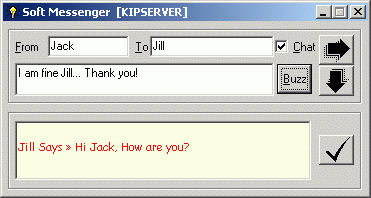



## Soft Messenger

### Description

The ultimate network messaging utitlity, that I developed in VB. It is compact and easy to use. Can be used for sending popup messages or chatting in an intranet. Features include automatic populating of network users, flexibility to store users list in a text file for faster use, Buzz option while chatting, etc.
 
### More Info
 
Winsock Control is required

             |
---                |---
**Submitted On**   |2003-07-11 12:45:18
**By**             |[Sameer C T](https://github.com/Planet-Source-Code/PSCIndex/blob/master/ByAuthor/sameer-c-t.md)
**Level**          |Advanced
**User Rating**    |4.0 (24 globes from 6 users)
**Compatibility**  |VB 6\.0
**Category**       |[Complete Applications](https://github.com/Planet-Source-Code/PSCIndex/blob/master/ByCategory/complete-applications__1-27.md)
**World**          |[Visual Basic](https://github.com/Planet-Source-Code/PSCIndex/blob/master/ByWorld/visual-basic.md)
**Archive File**   |[Soft\_Messe169092162004\.zip](https://github.com/Planet-Source-Code/sameer-c-t-soft-messenger__1-50818/archive/master.zip)

